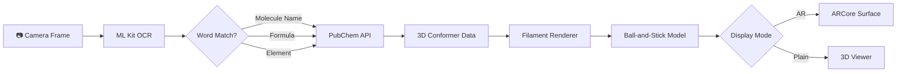

# 🧪 AR Chemistry — Interactive 3D Molecular Viewer

> An Android application that uses **Augmented Reality** and **real-time text recognition** to scan chemical names, formulas, or element names and instantly render interactive **3D ball-and-stick molecular models** — right on your desk.

---

## ✨ Features

### 🔍 Real-Time Text Recognition
- Point your camera at handwritten or printed text containing chemical names, formulas, or element names
- Powered by **Google ML Kit** text recognition with built-in OCR error correction (handles `0↔O`, `1↔I`, `5↔S` misreads)
- Supports **100+ molecules, formulas, and elements** including:
  - Common names: `Water`, `Caffeine`, `Aspirin`, `Glucose`, `Ethanol`...
  - Molecular formulas: `H2O`, `CO2`, `C6H12O6`, `C8H10N4O2`...
  - Element names: `Hydrogen`, `Carbon`, `Oxygen`, `Iron`, `Gold`...

### 🧬 3D Molecular Rendering
- Ball-and-stick models built in real-time using **Google Filament** rendering engine
- Accurate **CPK color coding** (Carbon = dark gray, Oxygen = red, Nitrogen = blue, etc.)
- Correct atom radii based on Van der Waals radii
- Bond cylinders connecting atom pairs with proper orientation via quaternion math
- Fetches real 3D conformer data from **PubChem PUG REST API** (falls back to 2D when 3D unavailable)

### 📱 Dual Viewing Modes
| Mode | Description |
|------|-------------|
| **AR Mode** | Places molecules on detected surfaces using ARCore plane detection. Walk around the molecule in real 3D space |
| **Plain Mode** | White-background 3D viewer with direct camera controls. Works on devices without AR support |

### 🤏 Gesture Controls
- **Single-finger drag** → Rotate molecule (X/Y axes) with momentum physics
- **Pinch** → Scale model (zoom in/out)
- **Two-finger twist** → Rotate around Z-axis
- Smooth **momentum damping** for natural-feeling interaction

### 📊 Molecule Info Panel
- Displays IUPAC name, molecular formula, and molecular weight
- Property cards: bond angle, molecular geometry, lone pairs
- Categorized info tabs: **Structure**, **Bonds**, **Polarity**, **Uses**
- Color-coded classification chips (Polar/Nonpolar, Hybridization, Geometry)

### 🔗 PubChem Integration
- Live data from the **National Library of Medicine's PubChem** database
- Search disambiguation dialog when multiple compounds match a query
- Fetches 3D atom coordinates, bond data, and compound descriptions
- Rate-limited HTTP client with proper error handling

---

## 🏗️ Architecture

```
com.armodel.app/
├── ArModelActivity.kt           # Main activity — AR/Plain modes, UI, gesture handling
├── TextRecognitionManager.kt    # ML Kit text recognition with throttling
├── ModelRepository.kt           # Keyword → molecule/model mapping + OCR correction
├── PubChemApi.kt                # PubChem REST API client (search, 3D conformers, properties)
├── MoleculeData.kt              # Data models (AtomData, BondData, MoleculeProperties, AtomColors, AtomRadii)
├── MoleculeRenderer.kt          # Filament-based 3D ball-and-stick renderer
└── RotationGestureDetector.kt   # Custom two-finger rotation gesture detector
```

---

## 🛠️ Tech Stack

| Technology | Purpose |
|---|---|
| **Kotlin** | Primary language |
| **ARCore** | Surface detection and AR anchoring |
| **SceneView** | AR + 3D scene management (wraps Filament) |
| **Google Filament** | Real-time PBR 3D rendering (spheres, cylinders, lights) |
| **ML Kit** | On-device text recognition from camera frames |
| **PubChem API** | 3D molecular data, compound properties, descriptions |
| **OkHttp** | HTTP networking |
| **Gson** | JSON parsing |
| **Material Design 3** | UI components and theming |

---

## 📋 Requirements

- Android **9.0+** (API 28)
- Camera permission
- Internet connection (for PubChem API and remote 3D models)
- ARCore-compatible device (optional — falls back to Plain mode)

---

## 🚀 Getting Started

### Prerequisites
- [Android Studio](https://developer.android.com/studio) (Hedgehog or newer)
- Android SDK 34
- JDK 17

### Build & Run

```bash
# Clone the repository
git clone https://github.com/adarsh-9398/AR-Chemistry-Unity-Vuforia.git
cd AR-Chemistry-Unity-Vuforia

# Open in Android Studio and sync Gradle
# OR build from command line:
./gradlew assembleDebug

# Install on connected device
./gradlew installDebug
```

### Usage

1. **Launch** the app on your phone
2. **Point** the camera at any text containing a chemical name or formula
3. **Wait** for the molecule to be recognized (you'll see a detection chip)
4. The app fetches 3D data from PubChem and **renders the molecule** on a detected surface
5. Use **gestures** to rotate, scale, and inspect the molecule
6. Toggle to **Plain mode** for a clean white-background viewer
7. Tap **Reset** to scan for a new molecule

---

## 📸 How It Works



---

## 📝 Supported Molecules (Partial List)

<details>
<summary><strong>Common Names (37+)</strong></summary>

Water, Ethanol, Methanol, Aspirin, Caffeine, Glucose, Sucrose, Salt, Ammonia, Methane, Ethane, Propane, Butane, Benzene, Toluene, Acetone, Acetic Acid, Penicillin, Ibuprofen, Paracetamol, Dopamine, Serotonin, Adrenaline, Insulin, Cholesterol, Nicotine, Morphine, Vitamin C, Citric Acid, Sulfuric Acid, Hydrochloric Acid, Nitric Acid, DNA, ATP...
</details>

<details>
<summary><strong>Molecular Formulas (21+)</strong></summary>

H2O, CO2, O2, N2, H2, CH4, C2H6, C2H5OH, NH3, HCl, NaCl, H2SO4, HNO3, C6H12O6, C6H8O7, C8H10N4O2, C9H8O4, C3H6O, C2H4O2, C6H6, C10H15NO...
</details>

<details>
<summary><strong>Elements (28+)</strong></summary>

Hydrogen, Helium, Lithium, Carbon, Nitrogen, Oxygen, Fluorine, Neon, Sodium, Magnesium, Aluminum, Silicon, Phosphorus, Sulfur, Chlorine, Argon, Potassium, Calcium, Iron, Copper, Zinc, Bromine, Silver, Iodine, Gold, Mercury, Lead, Uranium...
</details>

> **Plus**: any text that looks like a chemical formula (e.g. `C12H22O11`) is automatically searched on PubChem, even if it's not in the built-in list.

---

## 📄 License

This project is open source and available for educational purposes.

---

## 👤 Author

**Adarsh** — [@adarsh-9398](https://github.com/adarsh-9398)

---

<p align="center">
  Built with ❤️ for chemistry education
</p>
